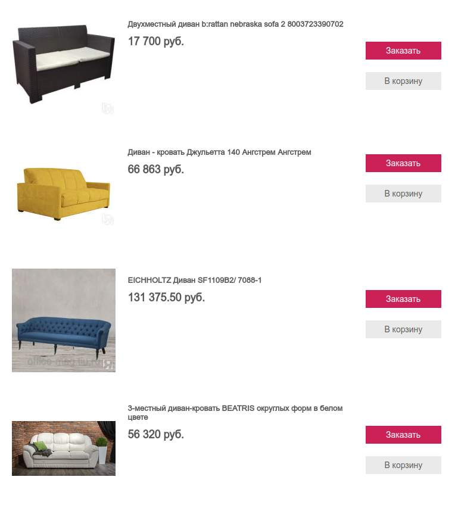
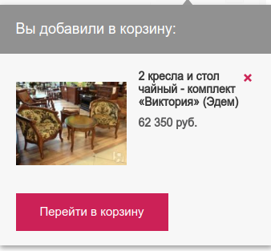
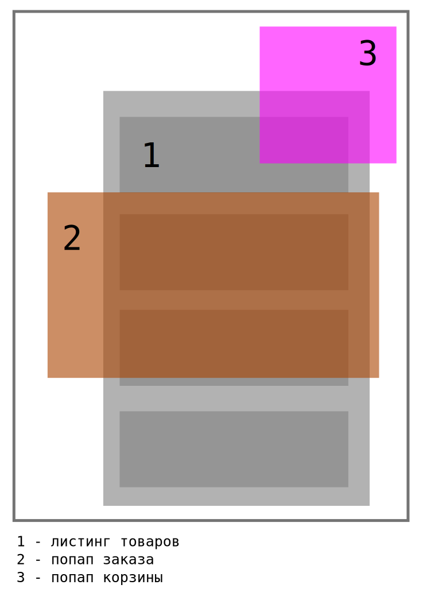

Тестовое задание на должность фронтенд-разработчика
===================================================

Необходимо разработать клиентскую часть листинга товаров с попапом заказа и добавления в корзину. Пользователь должен
увидеть листинг товаров, у каждого товара есть кнопка заказа и кнопка добавления в корзину. При нажатии на кнопку 
заказа должен открываться попап заказа, при нажатии на кнопку добавления в корзину - попап с уведомлением об успешном
добавлении в корзину. 

Логику работы корзины, отправки заказа, получения списка товаров с сервера писать не нужно.

Организацию файловой структуры, архитектуру, стайлгайд, способы подключения ассетов и прочее выбираешь сам. Фреймворки, 
библиотеки, шаблонизаторы использовать нельзя - чистый js и css.

Весь код нужно разместить в папке `src`. Точка входа - `src/index.html`. На странице, сразу после загрузки доступны 
данные о товарах, которые необходимо показать, получить их можно вызвав `API.products` в твоем js-коде. Твой код должен 
использовать эти данные для отрисовки листинга товаров и попапов заказа. 

**Макеты**

* макет листинга:

  

* макет попапа-заказа:

  

* макет попапа-корзины:

  

* схема позиционирования элементов

  

**Требования к реализации**

* IE11+;
* только десктоп, мобильная версия не нужна;
* pixel-perfect и 100% соответствие макетам не требуется;
* требований к адаптивности нет - достаточно выполнить в 1 размере;
* семантическая верстка приветствуется;
* рендер через js на основе полученных данных из API.
